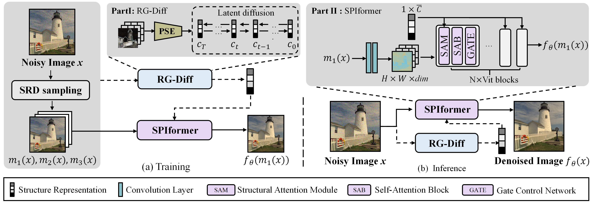
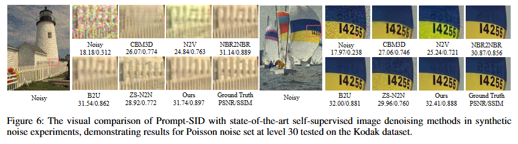
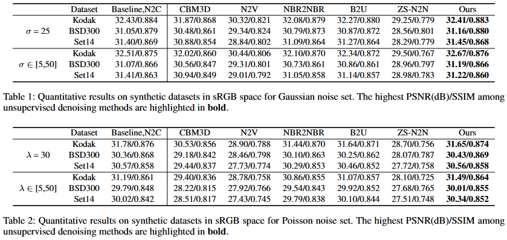

# Prompt-SID: Learning Structural Representation Prompt via Latent Diffusion for Single-Image (AAAI2025)

[Paper](https://arxiv.org/abs/2502.06432)
#### News
- **Jan, 18, 2025:** Our project is received as **Poster** by AAAI2025!  

> **Abstract:** *Many studies have concentrated on constructing supervised models utilizing paired datasets for image denoising, which proves to be expensive and time-consuming. Current self-supervised and unsupervised approaches typically rely on blind-spot networks or sub-image pairs sampling, resulting in pixel information loss and destruction of detailed structural information, thereby significantly constraining the efficacy of such methods. In this paper, we introduce Prompt-SID, a prompt-learning-based single image denoising framework that emphasizes preserving of structural details. This approach is trained in a self-supervised manner using downsampled image pairs. It captures original-scale image information through structural encoding and integrates this prompt into the denoiser. To achieve this, we propose a structural representation generation model based on the latent diffusion process and design a structural attention module within the transformer-based denoiser architecture to decode the prompt. Additionally, we introduce a scale replay training mechanism, which effectively mitigates the scale gap from images of different resolutions. We conduct comprehensive experiments on synthetic, real-world, and fluorescence imaging datasets, showcasing the remarkable effectiveness of Prompt-SID.* 
>

  

---
## Installation
  pytorch=1.11.0
  torchaudio=0.11.0
  torchvision=0.12.0
  numpy=1.21.5

## Results
Experiments are performed for different image denoising tasks including synthetic denoising, real-world denoising and fluorescence imaging denoising. 

  

  

## Citation
If you use Prompt-SID, please consider citing:

    @article{li2025prompt,
      title={Prompt-SID: Learning Structural Representation Prompt via Latent Diffusion for Single-Image},
      author={Huaqiu Li and Wang Zhang and Xiaowan Hu and Tao Jiang and Zikang Chen and Haoqian Wang},
      journal={AAAI},
      year={2025}
    }

