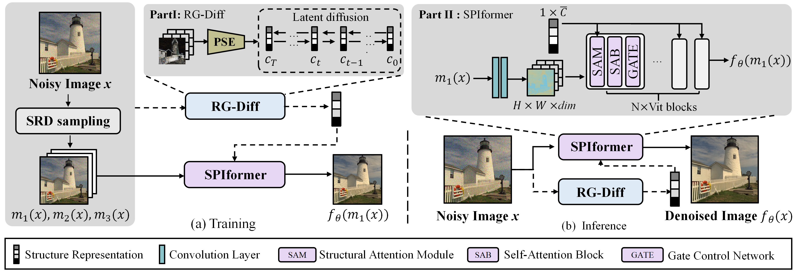
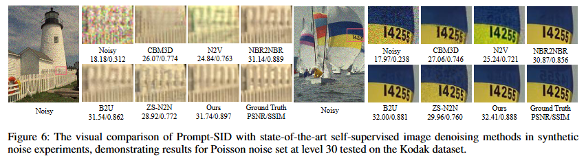
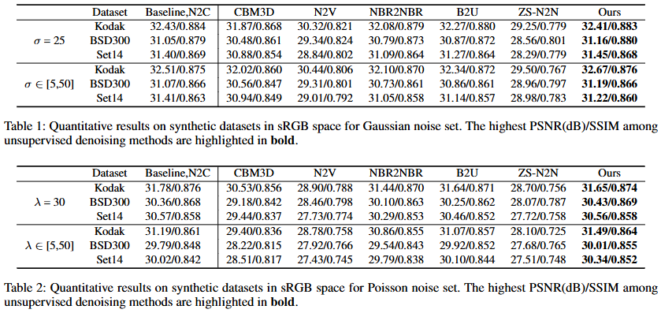

# Prompt-SID: Learning Structural Representation Prompt via Latent Diffusion for Single-Image Denoising (AAAI 2025)

[Paper](https://arxiv.org/abs/2502.06432) | [AAAI Proceedings](https://ojs.aaai.org/index.php/AAAI/article/view/32500)

Official implementation of Prompt-SID, a self-supervised single-image denoising method that learns a structural representation through latent diffusion. Here, **prompt** means a latent structural representation extracted from the noisy image, not a natural-language prompt.
#### News
- **Jan, 18, 2025:** Our project is received as **Poster** by AAAI2025!  
- **Mar, 15, 2025:** We have released the training and testing code for synthetic denoising and real-world denoising! 

> **Abstract:** *Many studies have concentrated on constructing supervised models utilizing paired datasets for image denoising, which proves to be expensive and time-consuming. Current self-supervised and unsupervised approaches typically rely on blind-spot networks or sub-image pairs sampling, resulting in pixel information loss and destruction of detailed structural information, thereby significantly constraining the efficacy of such methods. In this paper, we introduce Prompt-SID, a prompt-learning-based single image denoising framework that emphasizes preserving of structural details. This approach is trained in a self-supervised manner using downsampled image pairs. It captures original-scale image information through structural encoding and integrates this prompt into the denoiser. To achieve this, we propose a structural representation generation model based on the latent diffusion process and design a structural attention module within the transformer-based denoiser architecture to decode the prompt. Additionally, we introduce a scale replay training mechanism, which effectively mitigates the scale gap from images of different resolutions. We conduct comprehensive experiments on synthetic, real-world, and fluorescence imaging datasets, showcasing the remarkable effectiveness of Prompt-SID.* 
>

  

---
## Installation

    pytorch=1.11.0
    torchaudio=0.11.0
    torchvision=0.12.0
    numpy=1.21.5

Please see [pip.sh](pip.sh) for more installation of dependencies required to run Prompt-SID.

## Running
For training synthetic denoising, run the following command:

    sh trains_rgb.sh

You can add different types and intensities of noise by modifying line 201 of file [unit8_model.py](PromptSID/models/unit8_model.py).

For testing synthetic denoising, run the following command:

    sh test.sh

For training real-world denoising, run the following command:

    sh train_sidd.sh

For testing real-world denoising, run the following command to generate the data format required for website submission:

    python test_sidd_benchmark.py

## Results
Experiments are performed for different image denoising tasks including synthetic denoising, real-world denoising and fluorescence imaging denoising. 

On the SIDD validation and benchmark sets, Prompt-SID improves PSNR over Neighbor2Neighbor by 0.55 dB and 0.49 dB, respectively, and over Blind2Unblind by 0.23 dB and 0.19 dB. It also generalizes to fluorescence imaging denoising; see the paper for the full protocol, comparisons, and ablations.

  

  

## Citation
If you use Prompt-SID, please consider citing:

    @article{li2025promptsid,
      title={Prompt-SID: Learning Structural Representation Prompt via Latent Diffusion for Single-Image Denoising},
      author={Li, Huaqiu and Zhang, Wang and Hu, Xiaowan and Jiang, Tao and Chen, Zikang and Wang, Haoqian},
      journal={Proceedings of the AAAI Conference on Artificial Intelligence},
      volume={39},
      number={5},
      pages={4734--4742},
      year={2025},
      doi={10.1609/aaai.v39i5.32500}
    }

Our code is built upon [Neighbor2neighbor](https://github.com/TaoHuang2018/Neighbor2Neighbor) and [DiffIR](https://github.com/Zj-BinXia/DiffIR). We sincerely thank them for their contributions.
